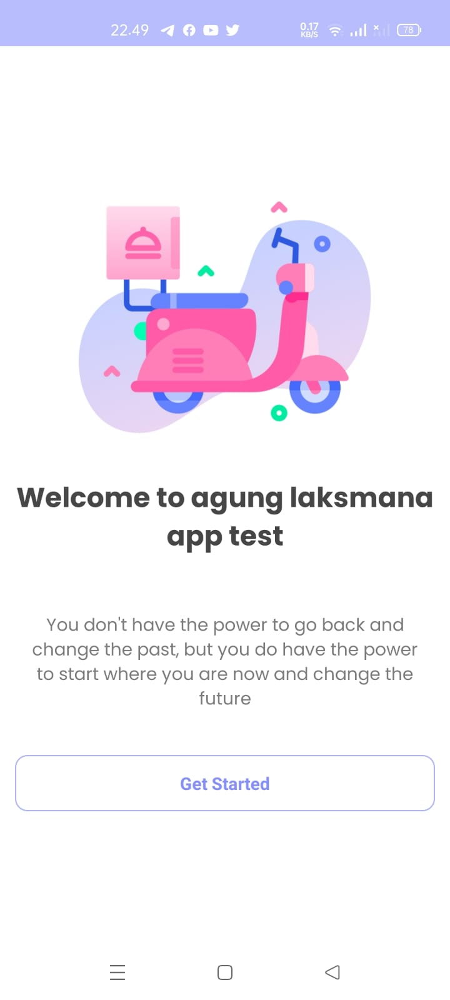
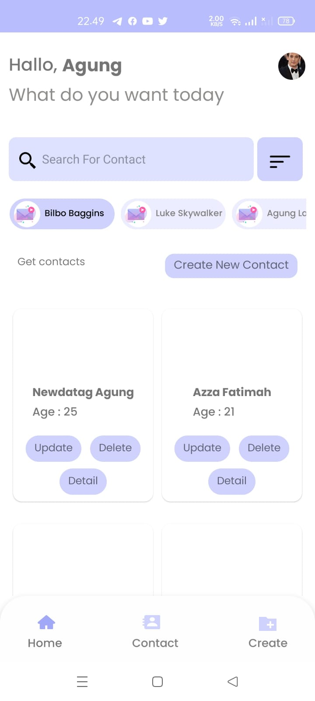
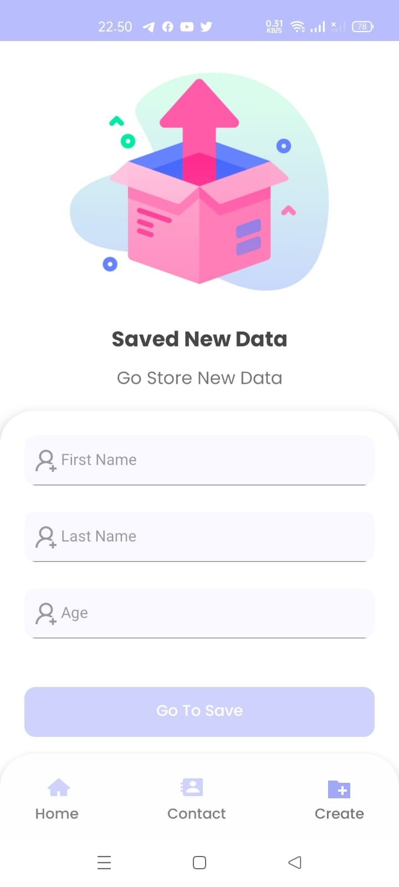
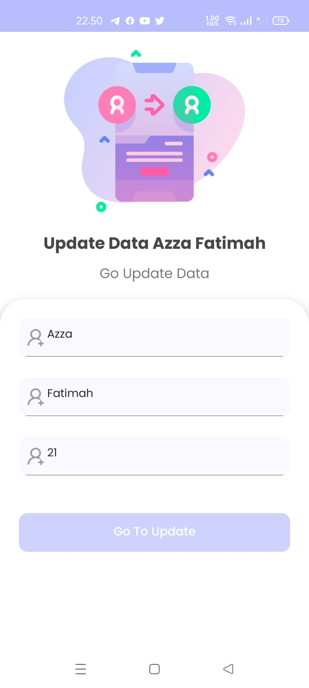

# agunglaksmana_Apptest

## Screenshots

![]
![]
![]
![]

## Getting started

1. SiLahkan Clone Project ini
1. Run `yarn install`:
   - `yarn android`:
 pastikan kamu sudah menginstall android studio dan openJDK8

